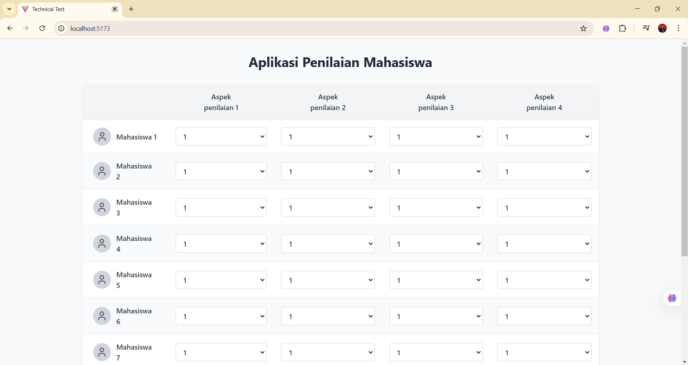

# Technical Assignment – Aplikasi Penilaian Mahasiswa

## 📌 Deskripsi Proyek
Aplikasi ini merupakan **Technical Assignment** berupa **Aplikasi Penilaian Mahasiswa** berbasis **React**.  
Aplikasi digunakan oleh dosen untuk memberikan penilaian kepada mahasiswa berdasarkan beberapa aspek penilaian.

Fokus utama pengembangan aplikasi ini adalah:
- Implementasi React dengan **proses render seminimal mungkin**
- Pengelolaan data input yang efisien
- Output data dalam format **JSON sesuai kebutuhan dosen**
---
## 🛠️ Teknologi yang Digunakan
- **React** (Vite)
- **JavaScript (ES6+)**
- **HTML & CSS**
- **Node.js & npm**

### Screenshoot 

git clone https://github.com/riswaldy/technical-assignment.git
cd technical-assignment

npm install

npm run dev

